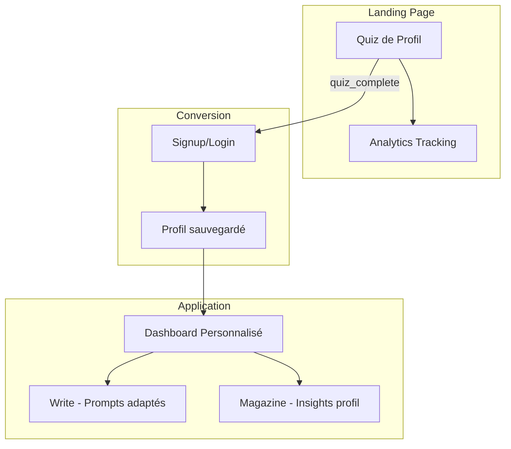

# Phase 4 - Évolution du Quiz de Profil

**Date:** 18 février 2026  
**Statut:** Plan de phase 4 validé  
**Priorité:** P0 Analytics → P1 Intégration UX → P2 Amélioration Quiz

---

## Vue d'ensemble

Cette phase 4 vise à transformer le quiz de profil d'un simple outil de conversion en un véritable pilier de l'expérience utilisateur Aurum. Le profil ne sera plus seulement un résultat affiché une fois, mais un compagnon personnalisé tout au long du parcours.

---

## Architecture Globale



---

## P0 - Analytics & Tracking (Semaine 1)

### Objectif

Mettre en place un système de tracking complet pour mesurer et optimiser le funnel de conversion du quiz.

### Événements à tracker

| Événement             | Déclencheur                | Données                                | Objectif                     |
| --------------------- | -------------------------- | -------------------------------------- | ---------------------------- |
| `quiz_started`        | Clic sur première réponse  | timestamp, source_page                 | Mesurer l'engagement initial |
| `quiz_step_completed` | Chaque question répondue   | step_number, answer_letter, time_spent | Identifier les drop-offs     |
| `quiz_completed`      | Dernière question répondue | profile_result, total_time             | Taux de complétion           |
| `quiz_result_viewed`  | Affichage du résultat      | profile_result, time_on_result         | Engagement post-quiz         |
| `quiz_cta_clicked`    | Clic "Créer mon compte"    | profile_result, cta_location           | Conversion vers signup       |
| `signup_with_quiz`    | Inscription après quiz     | profile_result, referrer               | Attribution conversion       |
| `profile_modal_shown` | Modal résultat dans l'app  | profile_result, days_since_signup      | Ré-engagement                |

### Implémentation technique

**Option A: Google Analytics 4 (Recommandé)**

- Avantage : Gratuit, intégration simple, dashboards natifs
- Inconvénient : Limitations sur les données utilisateur (RGPD)

**Option B: Mixpanel/Amplitude**

- Avantage : Analytics produit avancé, funnels visuels
- Inconvénient : Coût à volume

**Option C: Solution maison Firebase**

- Avantage : Données propriétaires, coût maîtrisé
- Inconvénient : Développement custom nécessaire

### Structure de données Firestore (Option C)

```typescript
interface QuizAnalytics {
  sessionId: string;
  userId?: string;
  startedAt: Timestamp;
  completedAt?: Timestamp;
  steps: {
    stepNumber: number;
    answer: string;
    timeSpentMs: number;
  }[];
  result?: {
    profile: string;
    confidence: number;
  };
  converted: boolean;
  source: "landing" | "popup" | "referral";
  device: "mobile" | "tablet" | "desktop";
}
```

### KPIs à suivre

1. **Taux de complétion** : Objectif > 70%
2. **Temps moyen par question** : Identifier les questions difficiles
3. **Taux de conversion quiz → signup** : Objectif > 25%
4. **Distribution des profils** : Vérifier l'équilibre
5. **Drop-off par étape** : Optimiser les questions problématiques

---

## P1 - Intégration Profils dans l'UX (Semaines 2-3)

### 1.1 Sauvegarde du profil utilisateur

**Firestore Schema Update:**

```typescript
interface UserProfile {
  // ... champs existants

  quizProfile: {
    profileId: "PIONEER" | "CONNECTOR" | "ANCHOR" | "ARCHITECT" | "BALANCED";
    calculatedAt: Timestamp;
    answers: string[]; // ['A', 'B', 'C', 'D']
    confidence: number; // 0-1
  };

  // Pour évolution future
  personalityEvolution: {
    date: Timestamp;
    profileId: string;
    source: "quiz" | "ai_analysis" | "questionnaire";
  }[];
}
```

**Migration des données existantes:**

- Script pour transférer les profils localStorage → Firestore lors du login
- Rétroactivité pour les utilisateurs existants

### 1.2 Dashboard Personnalisé

**Composant: `ProfileDashboardCard`**

Affichage du profil dans le dashboard avec:

- Badge profil avec couleur associée
- Description personnalisée
- "Votre force" + "Votre défi" selon le profil
- CTA vers le détail complet

**Mapping profil → Insights:**

| Profil       | Force         | Défi            | Suggestion                                   |
| ------------ | ------------- | --------------- | -------------------------------------------- |
| Pionnier     | Action rapide | Patience        | Prenez 5min pour réfléchir avant d'agir      |
| Connecteur   | Empathie      | Frontières      | C'est OK de dire non parfois                 |
| Ancre        | Stabilité     | Changement      | Un petit pas hors de votre zone de confiance |
| Architecte   | Précision     | Perfectionnisme | Faites d'abord, améliorez après              |
| Équilibriste | Adaptabilité  | Focus           | Choisissez UNE direction aujourd'hui         |

### 1.3 Suggestions d'écriture personnalisées

**Composant: `ProfileWritingPrompt`**

Intégration dans la page `/sanctuary/write`:

- Prompt quotidien adapté au profil
- Rotation de 30 prompts par profil
- Option "Prompt surprise" (hors profil)

**Exemples de prompts par profil:**

**Pionnier:**

- "Quelle décision avez-vous prise aujourd'hui dont vous êtes fier ?"
- "Décrivez votre prochain objectif en 3 étapes concrètes"
- "Qu'est-ce qui vous donne de l'énergie en ce moment ?"

**Connecteur:**

- "Quelle interaction aujourd'hui vous a touché émotionnellement ?"
- "Écrivez une lettre de gratitude à quelqu'un"
- "Quelles émotions ressentez-vous en ce moment ?"

**Ancre:**

- "Décrivez votre refuge parfait. Qu'y a-t-il ?"
- "Quelles routines vous apportent du réconfort ?"
- "Qu'est-ce qui vous aide à retrouver votre calme ?"

**Architecte:**

- "Analysez une situation récente sous 3 angles différents"
- "Quelles sont vos hypothèses sur un problème actuel ?"
- "Décrivez un système ou processus que vous aimeriez améliorer"

**Équilibriste:**

- "Quelles sont les différentes facettes de votre journée ?"
- "Comment équilibrez-vous vos besoins contradictoires ?"
- "Quelle partie de vous avez-vous négligée récemment ?"

### 1.4 Page détaillée du profil

**Nouvelle route: `/sanctuary/profile`**

Contenu:

- Description approfondie du profil
- Comparaison avec les autres profils
- Conseils de journaling spécifiques
- Graphique d'évolution (si données AI disponibles)
- Option "Refaire le test" (avec confirmation)

---

## P2 - Amélioration du Quiz (Semaine 4)

### 2.1 Extension à 8 questions

**Nouvelles questions proposées:**

**Question 5 - Prise de décision:**
"Quand vous devez choisir, vous privilégiez :"

- A) L'efficacité et la rapidité
- B) L'impact sur les autres
- C) La sécurité et la prévisibilité
- D) La logique et les faits

**Question 6 - Communication:**
"Votre style de communication naturel :"

- A) Direct et concis
- B) Chaleureux et expressif
- C) Posé et réfléchi
- D) Structuré et précis

**Question 7 - Environnement de travail:**
"Votre environnement idéal :"

- A) Dynamique, avec des défis constants
- B) Collaboratif, avec beaucoup d'échanges
- C) Stable, avec peu de changements
- D) Organisé, avec des processus clairs

**Question 8 - Motivation:**
"Ce qui vous motive le plus :"

- A) Les résultats et la victoire
- B) La reconnaissance et la connexion
- C) La sécurité et l'appartenance
- D) La maîtrise et l'excellence

### 2.2 Algorithme de scoring amélioré

**Scoring pondéré:**

```typescript
interface WeightedAnswer {
  answer: string;
  weight: number; // 1.0 = standard, 1.5 = forte discrimination
}

// Questions 1-4: poids 1.0 (contexte général)
// Questions 5-8: poids 1.5 (comportement spécifique)

function calculateProfile(answers: WeightedAnswer[]): ProfileResult {
  const scores = { A: 0, B: 0, C: 0, D: 0 };

  answers.forEach(({ answer, weight }) => {
    scores[answer] += weight;
  });

  // Normalisation et détermination
  // ...
}
```

### 2.3 Indicateur de confiance

Afficher un score de confiance dans le résultat:

- 90-100% : Profil clair
- 70-89% : Profil probable
- < 70% : Équilibriste (mixte)

---

## P3 - Fonctionnalités Futures (Backlog)

### A/B Testing Framework

- Test de formulations de questions
- Test d'ordre des questions
- Test de présentation des résultats

### Évolution du profil

- Re-test tous les 3 mois
- Comparaison évolution
- Insights sur les changements

### Social Features

- Partage de profil (optionnel)
- Comparaison avec amis/partenaire
- Insights de compatibilité

### Intégration AI

- Analyse des entrées pour affiner le profil
- Suggestions ultra-personnalisées
- Détection de changements de phase de vie

---

## Plan d'implémentation

### Semaine 1: Analytics (P0)

- [ ] Choisir et configurer la solution de tracking
- [ ] Implémenter les events côté client (ProfileQuiz.tsx)
- [ ] Créer le schema Firestore pour analytics
- [ ] Dashboard de suivi des KPIs
- [ ] Test et validation

### Semaine 2: Intégration UX Partie 1 (P1)

- [ ] Migration profil localStorage → Firestore
- [ ] Composant ProfileDashboardCard
- [ ] Page /sanctuary/profile
- [ ] Test utilisateur

### Semaine 3: Intégration UX Partie 2 (P1)

- [ ] Système de prompts personnalisés
- [ ] Intégration dans /sanctuary/write
- [ ] Rotation et variété des prompts
- [ ] Analytics des prompts utilisés

### Semaine 4: Amélioration Quiz (P2)

- [ ] Extension à 8 questions
- [ ] Nouvel algorithme de scoring
- [ ] Indicateur de confiance
- [ ] Migration des données existantes

---

## Questions ouvertes

1. **Consentement RGPD:** Faut-il un consentement explicite pour le tracking analytics ?
2. **Partage de profil:** Veut-on permettre aux utilisateurs de partager leur profil ?
3. **Évolution:** À quelle fréquence proposer de refaire le test ?
4. **Intégration AI:** Faut-il lier ce profil avec l'analyse de personnalité existante dans le Magazine ?

---

## Métriques de succès

| Métrique                       | Baseline      | Objectif Phase 4              |
| ------------------------------ | ------------- | ----------------------------- |
| Taux complétion quiz           | ~60% (estimé) | > 70%                         |
| Conversion quiz → signup       | ~15% (estimé) | > 25%                         |
| Utilisation des prompts profil | N/A           | > 30% des sessions d'écriture |
| Retention J+7                  | Baseline      | +10%                          |
| Satisfaction utilisateur (NPS) | Baseline      | +15 points                    |

---

_Plan créé par Architect Mode - Prêt pour implémentation_
